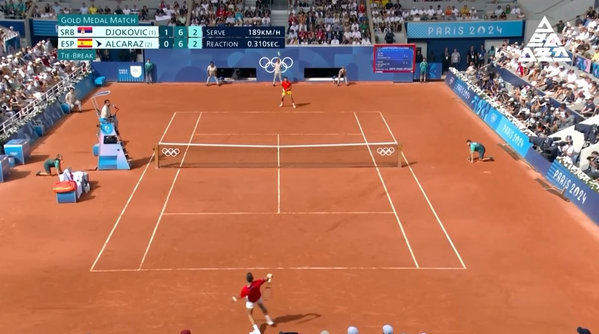
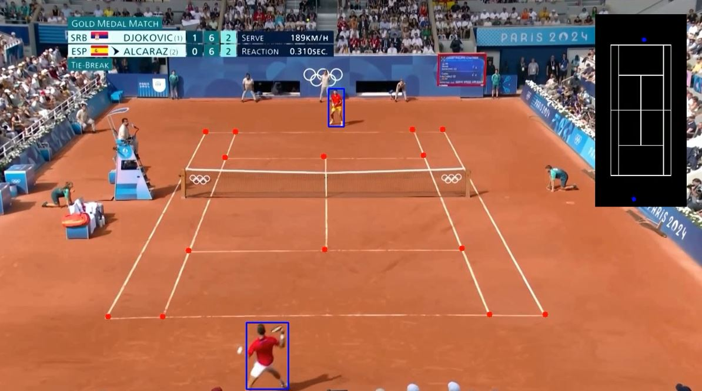

# MINI-AIFFELTHON
- 김서영, 김하영, 성연우

## 목표

- 장애를 가진 분들을 위해서의 목표가 가까워진다
- 이것을 가지고 데이터셋을 만들면 차별화를 얻을 수 있다
- 테니서 해설 데이터셋 예시를 몇개 만들 수 있다
- chat gpt api를 사용해서 멀티모달을 구현할 수 있다

### 스포츠 플레이 3D로 표현

- 시각 장애인의 경우 스포츠 경기를 실시간으로 즐기는 것에 어려움이 있다
- 플레이어와 공을 실시간으로 시청할 수 있도록 판넬로 표현한다
- 코치와 선수가 자신의 플레이를 실시간으로 분석할 수 있다
- **스포츠 종목  : 테니스**

  
### 시스템 동작 방식

- 실시간 영상 입력 수집
- YOLO 기반 객체 탐지 모델을 활용한 주요 이벤트 탐지
- 사용자가 직관적으로 경기 상황을 이해할 수 있도록 최적화된 정보 제공

https://github.com/yastrebksv/TennisProject/tree/main?tab=readme-ov-file
## 테니스 영상 해설
- 모델 처리 전 영상

- 모델 처리 후 영상

## 테니스 해설
**이미지 프롬프트**

[프롬프트]  

- 테니스 경기 릴레이가 진행되고 있는 중이다
- 해설 위원이 해설하는 것처럼 순서대로 있는 사진을 보고 해설해줘
- 사실을 기반으로 해설해줘  

[추가 설명(디텍팅 이미지에서만)]  

- 빨간색 점은 코드의 꼭짓점 부분을 나타낸다
- 파란색 박스는 각각의 플레이들을 나타낸다 
- 초록색은 공의 위치와 궤도를 나타낸다
- 화면 오른쪽 위에 있는 탑 뷰 이미지로 파란색은 플레이어의 위치 
- 노란색은 공이 바닥에 튕긴 부분을 점으로 나타낸 것이다
